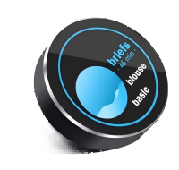

<h1 align = "center">UEDX24240013-MD50ESP32_1.3inch-Knob-Display</h1>

<p align="center" width="90%">
    
</p>

## **English | [中文](./README_CN.md)**

## Introduction to the Repository Directory

```
├── Libraries                 Library files required for the Arduino example  
├── Schematic                 The circuit schematic of the product   
├── examples                  Sample files, including the IDF framework and the Arduino framework
├── image                     Product or sample project related images
├── information               Product specifications, including the IC or peripherals involved
├── tools                     Burn tool and image conversion tool
└── README.md                 This is the file you are currently reading,Give a brief introduction to the product
```

## Version iteration:
|   Development board Version   |  Screen size   |   Resolution  | Update date        |Update description|
| :-------------------------------: | :-------------------------------: | :-------------------------------: | :-------------------------------: |:-------------------------------: |
| UEDX24240013-MD50E | 1.3-inch |  240*240  |2024-07-23      | Original version   |

## PurchaseLink

| Product                     | SOC           |  FLASH  |  RAM   | Link                   |
| :------------------------: | :-----------: |:-------: | :---------: | :------------------: |
| UEDX24240013-MD50E   | ESP32c3 |   4M   | 400KB | [VIEWE Mall](https://viewedisplay.com/product/esp32-7-inch-800x480-rgb-ips-tft-display-touch-screen-arduino-lvgl-uart/)  |

## Directory
- [Module](#module)
- [PinOverview](#pinoverview)
- [FPC PIN](#fpc-pin)
- [QuickStart](#quickstart)
- [FAQ](#faq)
- [Schematic](#Schematic)
- [Information](#information)
- [DependentLibraries](#dependentlibraries)

## Module

### 1.MCU

* Chip: ESP32-C3
* FLASH: 4M
* For more details, please visit[Espressif ESP32-C3 Datashee](https://www.espressif.com/sites/default/files/documentation/esp32-c3_datasheet_en.pdf)

### 2. Screen

* Size: 1.3-inch IPS screen
* Resolution: 240x240px
* Screen type: IPS
* Driver chip: GC9A01
* Compatibility library:  ESP32_Display_Panel
* Bus communication protocol: 4 Wire SPI

### 3. Touch

* Chip: No touch

## PinOverview

| IPS Screen Pin  | ESP32C3 Pin|
| :------------------: | :------------------:|
| SPI-CS         | IO10      |
| SPI-SCK      | IO1       |
| SPI-SDA      | IO0      |
| SPI-DC       | IO4       |
|   LCD-TE       |  IO5   | 
| BACKLIGHT  | IO8       |


| button Pin  | ESP32C3 Pin|
| :------------------: | :------------------:|
|   boot    | IO9       |

| Encoder Pin  | ESP32C3 Pin|
| :------------------: | :------------------:|
| PHA         | IO7       |
| PHB         | IO6       |

| USB  | ESP32C3 Pin|
| :------------------: | :------------------:|
| USB-DN         | IO18      |
| USB-DP         | IO19      |

| UART Pin  | ESP32C3 Pin|
| :------------------: | :------------------:|
|   UART0RXD     | IO20      |
|   UART0TXD     | IO21      |

## FPC PIN
| FPC number | Adapter Pin  | ESP32C3 Pin|
| :------------------: | :------------------: | :------------------:|
|  1  |    5V      |    5V    |
|  2  |    PB7     |  GPIO3   |
|  3  |    GND     |    GND   |
|  4  |    RX2     |    NC    |
|  5  |    TX2     |    NC    |
|  6  |    RX1     |    UART0RXD/IO20    |
|  7  |    TX1     |    UART0TXD/IO21    |
|  8  |     NC     |    CHIP-EN    |
|  9  |   SK & D+   |   USB-DP/ IO19    |
|  10 |   SD & D-   |    USB-DN/ IO18   |

## QuickStart

### Software Framework Configuration

| Support IDE | Version |
| ------  | ------  |
| `[ESP-IDF]` | `[V5.1/5.2/5.3]` |
| `[Arduino IDE]` | `[esp32 >=v3.1.0]` | 
| `[Platformio IDE]` |  |
### ESP-IDF Framework ([Novice tutorial]())
- Supported Versions: v5.1/5.2/5.3
- Download the example code from the repository and compile/run it directly.
- Repository Address: [examples](examples/esp_idf)

### Arduino Framework ([Novice tutorial]())
1. Install[Arduino](https://www.arduino.cc/en/software),Choose installation based on your system type.
2. Install the ESP32 core: Search for and download `esp32`(by Espressif >= v3.1.0) in the `Board Manager`.
3. Install the required libraries:
    * Search and install `ESP32_Display_Panel` (v1.0.3). Select `Yes` for automatic dependency installation.
    * Install the `LVGL` (v8.4.0) library. 
4. Open the example: `ESP32_Display_Panel`-> `examples` -> `arduino` -> `gui` -> `lvgl_v8`.
5. Configure the `esp_panel_board_supported_conf.h` file:
    * Enable the macro for this file: `#define ESP_PANEL_BOARD_DEFAULT_USE_SUPPORTED  (0)`——> `#define ESP_PANEL_BOARD_DEFAULT_USE_SUPPORTED  (1)`
    * Search development board `#define BOARD_VIEWE_UEDX24240013_MD50E`，And first comment to make it work. Note that do not turn on multiple development boards.
6. Configure tool options :
    #### ESP32-C3
    | Setting                               | Value                                 |
    | :-------------------------------: | :-------------------------------: |
    | Board                                 | ESP32C3 Dev Module           |
    | CPU Frequency                   | 160MHz (WiFi)                    |
    | Core Debug Level                | None                                 |
    | USB CDC On Boot                | Disabled                              |
    | Erase All Flash Before Sketch Upload                | Disabled         |
    | Flash Frequency                     | 80MHz                            |  
    | Flash Mode                         | QIO                               |
    | Flash Size                           | 4MB (32Mb)                      |
    | JTAG Adapter                 | Disabled                                |
    | Partition Scheme                | Custom |
    | Upload Speed                     | 921600                               |

   
7. Select the correct port.
8. Click "<kbd>[√](image/8.png)</kbd>" in the upper right corner to compile,If the compilation is correct, connect the microcontroller to the computer,Click "<kbd>[→](image/9.png)</kbd>" in the upper right corner to download.
9. If the color is abnormal after burning, please open the `lv_conf.h`file in the example and modify the configuration:`#define LV_COLOR_16_SWAP 0`——>`#define LV_COLOR_16_SWAP 1`


### firmware download

| Firmware | Description | Picture |
| ------  | ------  | ------ |
| [ESP-IDF]() | Original |  |

1. Open the project file "tools" and locate the ESP32 burning tool. Open it.

2. Select the correct burning chip and burning method, then click "OK." As shown in the picture, follow steps 1->2->3->4->5 to burn the program. If the burning is not successful, press and hold the "BOOT-0" button and then download and burn again.

3. Burn the file in the root directory of the project file "[firmware](./firmware/)" file,There is a description of the firmware file version inside, just choose the appropriate version to download.

<p align="center" width="100%">
    
    
</p>

## FAQ

* Q. After reading the above tutorials, I still don't know how to build a programming environment. What should I do?
* A. If you still don't understand how to build an environment after reading the above tutorials, you can refer to the [VIEWE-FAQ]() document instructions to build it.

<br />

* Q. Why does Arduino IDE prompt me to update library files when I open it? Should I update them or not?
* A. Choose not to update library files. Different versions of library files may not be mutually compatible, so it is not recommended to update library files.

<br />

* Q. Why is there no serial data output on the "Uart" interface on my board? Is it defective and unusable?
* A. The default project configuration uses the USB interface as Uart0 serial output for debugging purposes. The "Uart" interface is connected to Uart0, so it won't output any data without configuration.<br />For PlatformIO users, please open the project file "platformio.ini" and modify the option under "build_flags = xxx" from "-D ARDUINO_USB_CDC_ON_BOOT=true" to "-D ARDUINO_USB_CDC_ON_BOOT=false" to enable external "Uart" interface.<br />For Arduino users, open the "Tools" menu and select "USB CDC On Boot: Disabled" to enable the external "Uart" interface.

<br />

* Q. Why is my board continuously failing to download the program?
* A. Please hold down the "BOOT" button and try downloading the program again.

## Schematic
<p align="center" width="100%">
    
</p>

## Information
[products specification](information/UEDX24240013-MD50E%20V3.3%20SPEC.pdf)

[Display Datasheet](information/UE013QV-RH13-A003B.pdf)

[button](information/6x6Silent%20switch.pdf)

[Encoder](information/EC110101R6D-HA1-011%20YBGW080.pdf)

## DependentLibraries
* [ESP32_Display_Panel](https://github.com/esp-arduino-libs/ESP32_Display_Panel) (Please [download](./Libraries/ESP32_Display_Panel) the library first as the latest version has not been released yet)
* [ESP32_IO_Expander](https://github.com/esp-arduino-libs/ESP32_IO_Expander) (Please [download](./Libraries/ESP32_IO_Expander) the library first as the latest version has not been released yet)
* [ESP32_Button](https://github.com/esp-arduino-libs/ESP32_Button)
* [ESP32_Knob](https://github.com/esp-arduino-libs/ESP32_Knob)
* [lvgl-8.4.0](https://lvgl.io)


